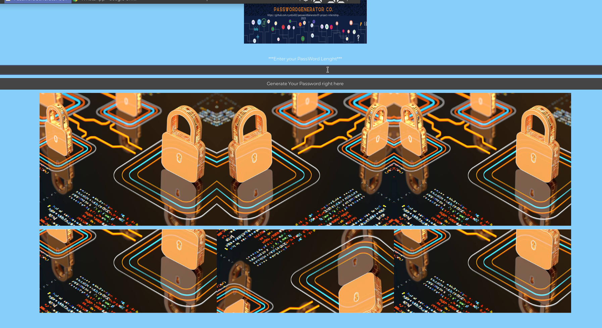

# passwordGenerator01-project-internship-2023

# Project Description:
To develop with the help of C language a password generator, using GTK to give it a better view at the graphical view.
<br>
Also what were the requirements?
<br>
Well, let's read it below

# Requirements
_Random generation of strong passwords
<br>
_User-selectable password length
<br>
_Complexity management (numbers, upper/lower case letters, special characters)
<br>
_Display of generated password
<br>
_User-friendly interface


# Compilation:

Via Makefile, including re, clean et fclean rules.

# Programming Language
- C

# Binary
```
./password_generator
```
# Individuel Project

# To be pushed on the git   
Github (Code Source, Makefile, Documentation, Readme
<br>
[Viewers: MouradAPE et edwinFrank])

# Project Appearrance
you can have a view of my interface.
<picture>
  
</picture>

# To test the program
 compile with
 ```
make //then

./password_generator //which is the project binary

```
# Once on the interface:

_Enter the lenght of your password in the bar
<br>
_Click on the ""Generate your password here" bar.
<br>
and tadah you get your password displayed right in front of you.

# Maintainer
Cyndzx02

# Thank youu!
